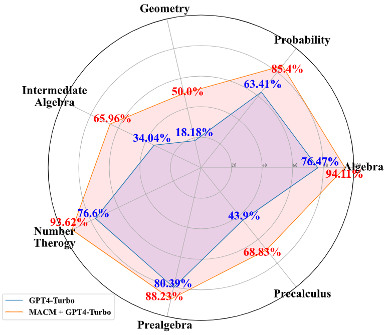

# MACM

## Introdcution

MACM is a system that utilizes multi agents to interact with each other in order to continuously explore potential conditions for solving complex mathematical problems.

<div align="center">
      
</div>


MACM extracts conditions and the objective from each math problem, iteratively adds new insights to the known conditions, and repeats this until enough information is gathered to reach a solution.

Compared to the old method of prompting. The advantages of MACM are as follows: 

1. **Stronger logical reasoning**. This is due to the fact that MACM removes the hierarchical structure of previous prompting methods, allowing arbitrary thoughts to be related to each other.

2. **Stronger generalization ability**. MACM does not need to re-design the prompt for each problem like the old tree of thought or graph of thought. it can be applied to arbitrary mathematical and logical reasoning problems. All the user needs to do is enter the problem and the process is completely automated.

## Performance

The experiments were mainly conducted on the MATH dataset, and due to financial constraints, we randomly selected 1/3 of the data in the MATH dataset for the experiments.


| Method | Algebra | Counting and Probability | Geometry | Intermediate Algebra | Number Theory | Prealgebra | Precalculus | Overall |
|:--------:|:---------:|:-------------------------:|:----------:|:----------------------:|:---------------:|:------------:|:-------------:|:---------:|
| I-O    | 88.24   | 81.63                   | 45.11    | 66.67                | 74.51         | 81.82      | 71.15       | 72.78   |
| CoT    | 92.99   | 83.67                   | 42.02    | 68.07                | 77.31         | 82.07      | 74.18       | 74.36   |
| SC-CoT | 94.96 | 87.17               | 50.14    | 71.99                | 89.91         | 86.75      | 79.67       | 80.12   |
| MACM   | 96.07   | 97.95                   | 62.74    | 78.43                | 98.04         | 94.11      | 88.46       | 87.92   |

  *Accuracy(%) comparison of GPT-4 Turbo on MATH dataset with different prompting Methods. \*Due to financial constraints, we randomly selected 1/3 of the data in the MATH dataset.*


<div align="center">
  
  <br> <!-- Optional line break to add some space between the image and the text -->
  <p> <i>The performance comparison of GPT-Turbo with and
without MACM on Level 5 problems of the MATH dataset.  *Due to financial constraints, we randomly selected 1/3 of the data in the MATH dataset.</i> </p>
</div>

## Quick Start

1. Install the necessary packages

```
conda create -n macm python=3.10.11
pip install -r requirements.txt
```

2. Enter your OpenAi Key in the `MACM/utils/gpt_robots.py` line 3. Enter your question in the `MACM/main.py` line 158. If you don't enter your question, there will be a `Error processing file` error.

3. Run 

```
python main.py
```

## Contact

Since there is a certain amount of randomness in the data generated by the LLM, the code may have some potential bugs. 
If you have any inquiries, please feel free to raise an issue or reach out to leib2765@gmail.com.

## Citation
```
@misc{lei2024macm,
      title={MACM: Utilizing a Multi-Agent System for Condition Mining in Solving Complex Mathematical Problems}, 
      author={Bin Lei¹, Yi Zhang¹, Shan Zuo¹, Ali Payani², Caiwen Ding¹},
      affiliated institution={University of Connecticut¹ & Cisco²}
      year={2024},
      eprint={2404.04735},
      archivePrefix={arXiv},
      primaryClass={cs.AI}
}
```


## Acknowledgments

Appreciation to Dr. Caiwen Ding for his financial support of this project.

