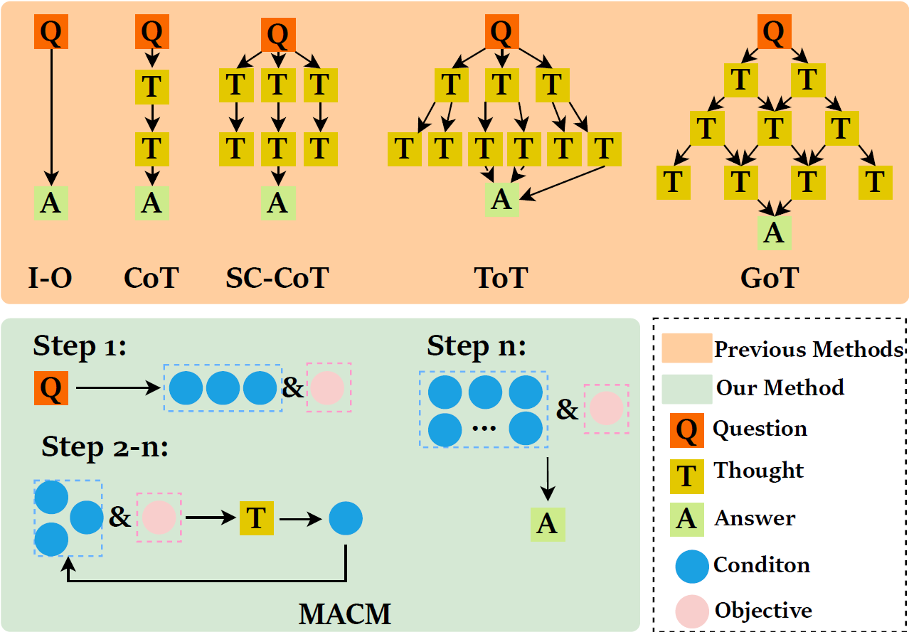

# MACM

## Introdcution

MACM is a system that utilizes multi agents to interact with each other in order to continuously explore potential conditions for solving complex mathematical problems.



MACM extracts conditions and the objective from each math problem, iteratively adds new insights to the known conditions, and repeats this until enough information is gathered to reach a solution.

Compared to the old method of prompting. The advantages of MACM are as follows: 

1. **Stronger logical reasoning**. This is due to the fact that MACM removes the hierarchical structure of previous prompting methods, allowing arbitrary thoughts to be related to each other.

2. **Stronger generalization ability**. MACM does not need to re-design the prompt for each problem like the old tree of thought or graph of thought. it can be applied to arbitrary mathematical and logical reasoning problems. All the user needs to do is enter the problem and the process is completely automated.

## Quick Start

1. Install the necessary packages

```
conda create -n macm python=3.10.11
pip install -r requirements.txt
```

2. Enter your OpenAI Key and question

Enter your OpenAi Key in the `MACM/utils/gpt_robots.py` line 3.

Enter your question in the `MACM/main.py` line 158. If you don't enter your question, there will be a `Error processing file` error.

3. Run 

```
python main.py
```

## Contact

Since there is a certain amount of randomness in the data generated by the large model, the code may have some potential bugs. 
If you have any inquiries, please feel free to raise an issue or reach out to leib2765@gmail.com.

## Citation


## Acknowledgments

Appreciation to Dr. Caiwen Ding for his financial support of this project.

